<p align="center">
  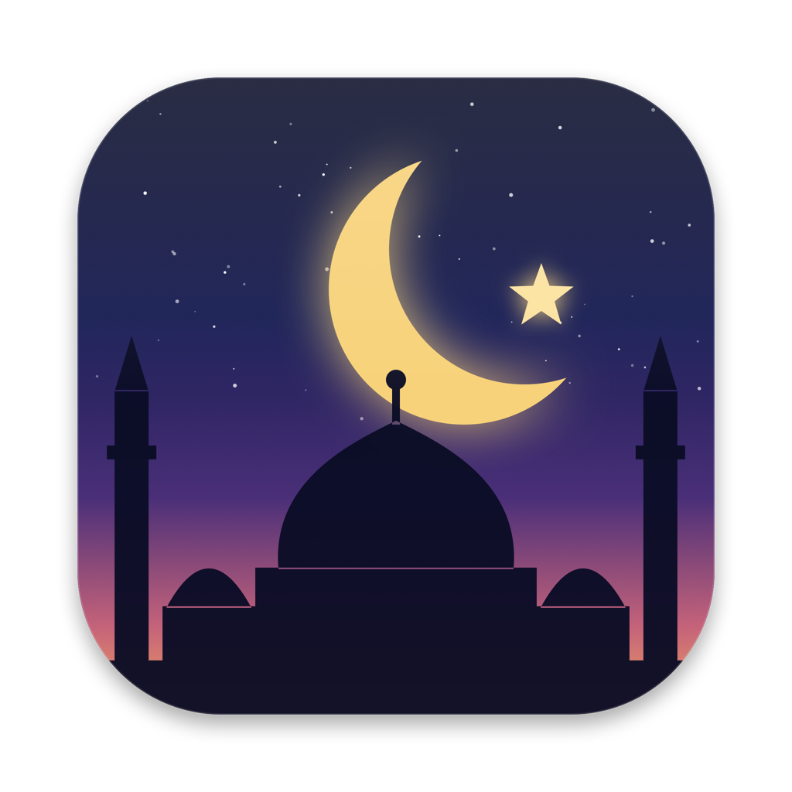
</p>

<h1 align="center">Salat · صلاة</h1>

<p align="center">
  <b>Prayer times for macOS, done beautifully.</b><br>
  Menu bar app · desktop widget · Azan · English &amp; العربية
</p>

<p align="center">
  <a href="https://github.com/mpcabd/salat-widget/releases/latest"><b>⬇︎ Download the latest .dmg</b></a>
</p>

<p align="center">
  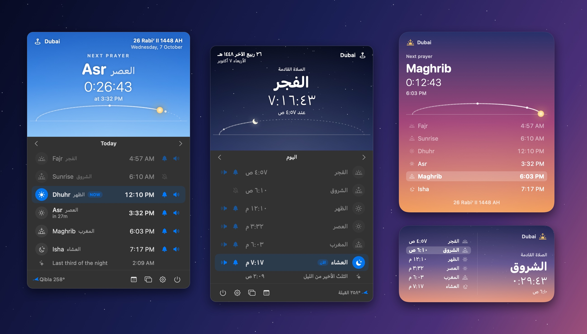
</p>

> [!NOTE]
> **This entire project was built by an AI, [Claude](https://claude.com/claude-code) (Opus 5.5), working on its own.**
> The prompt was one paragraph: *"build me the most amazing prayer times widget for macOS"* followed by *"You're completely on your own."*
> Claude did all of the following without help:
> - wrote the astronomical engine and checked it against a reference API
> - designed the UI and drew the app icon in code
> - found freely licensed Azan recordings
> - wrote the Arabic translation and right-to-left layout
> - built a render-to-PNG tool so it could check its own screens
> - produced this repository and release
>
> Xcode wasn't installed, so everything is built with the Swift command-line toolchain. No human wrote a line of the code. 🤖

## Features

**🕌 Always one glance away**
- The menu bar shows the next prayer and a live countdown (`☀ Asr −27m`). You can switch to icon only, name + time, or countdown only. Seconds appear automatically in the final minute.
- In the popover, the sky follows the real time of day: dawn violet, midday blue, golden afternoon, sunset pink, and stars at night. The sun or moon moves along its arc, with markers at Dhuhr and Asr.
- It also shows the Hijri and Gregorian dates, the Qibla bearing, and a way to browse other days. Each prayer row has a 🔔 notification toggle and a 🔊 Azan toggle.

**🔊 Azan**
- Five freely licensed recordings, including the late **Sabah Fakhri**, plus a gentle chime. You can choose a separate sound for **Fajr** or use **your own audio file**.
- Volume, gentle fade-in, and a *short Azan* mode (~30 s).
- To stop it, use the popover, the notification's **Stop Azan** button, or <kbd>Esc</kbd> while the popover is open. The menu bar icon changes while it plays.

**🔔 Your rules, per prayer**
- Turn notifications, Azan and a pre-prayer reminder (1–60 min) on or off separately for each prayer.

**🖼 Desktop widget**
- Small, medium or large, in the *living sky* style or translucent *glass*. It can sit on your desktop or float above windows. Drag it anywhere and right-click it for options.

**🌍 Accurate anywhere**
- Location is automatic: it follows you when you travel and uses each place's own time zone. You can also search for a city worldwide or enter coordinates.
- **22 calculation methods**, picked automatically from your country:

  | | | |
  |---|---|---|
  | Muslim World League | ISNA | Egyptian Authority |
  | Umm al-Qura (120 min Isha in Ramadan) | Karachi | Dubai |
  | Gulf | Kuwait | Qatar |
  | Moonsighting Committee (seasonal) | Singapore (MUIS) | Malaysia (JAKIM) |
  | Indonesia (Kemenag) | Turkey (Diyanet) | Tehran |
  | Shia Ithna-Ashari | France (UOIF) | Russia |
  | Morocco | Algeria | Tunisia |
  | Custom angles | | |

- Hanafi or Standard Asr, rules for high latitudes (and the polar day/night fallback), per-prayer minute adjustments, Hijri date correction, and optional Imsak, midnight and last-third-of-the-night times.
- Everything is computed **on your Mac**: no internet, no tracking.

**🌙 Truly bilingual**
- Full English and Arabic interfaces with proper right-to-left layout and Arabic-Indic numerals (٠١٢٣), independent of your system language.

**📅 And more**
- Monthly timetable with CSV export, Jumuʿah on Fridays, and a first-run setup screen.
- Handles sleep/wake, clock changes and time-zone changes correctly.

## Screenshots

<table>
  <tr>
    <td>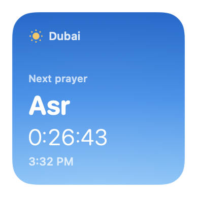</td>
    <td>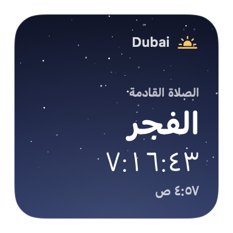</td>
    <td>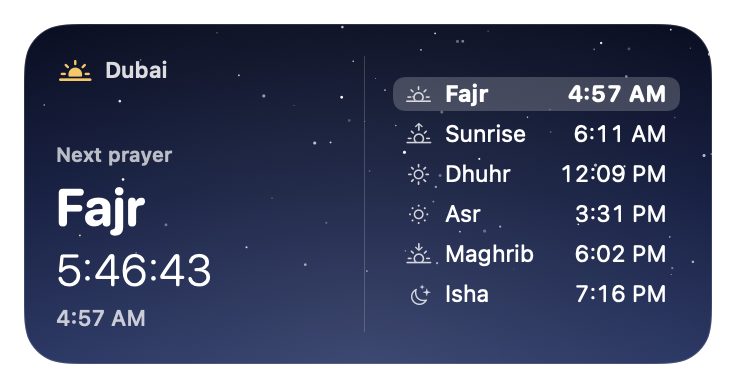</td>
  </tr>
  <tr>
    <td colspan="2">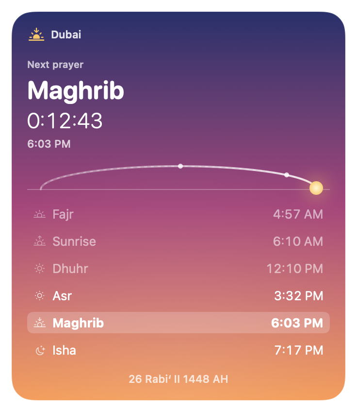</td>
    <td>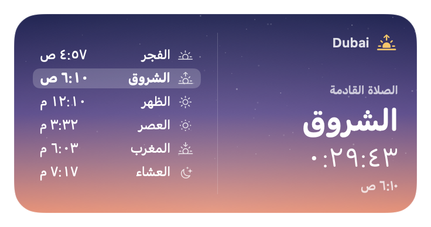</td>
  </tr>
</table>

| Calculation | Alerts | الأذان (Arabic) |
|---|---|---|
| 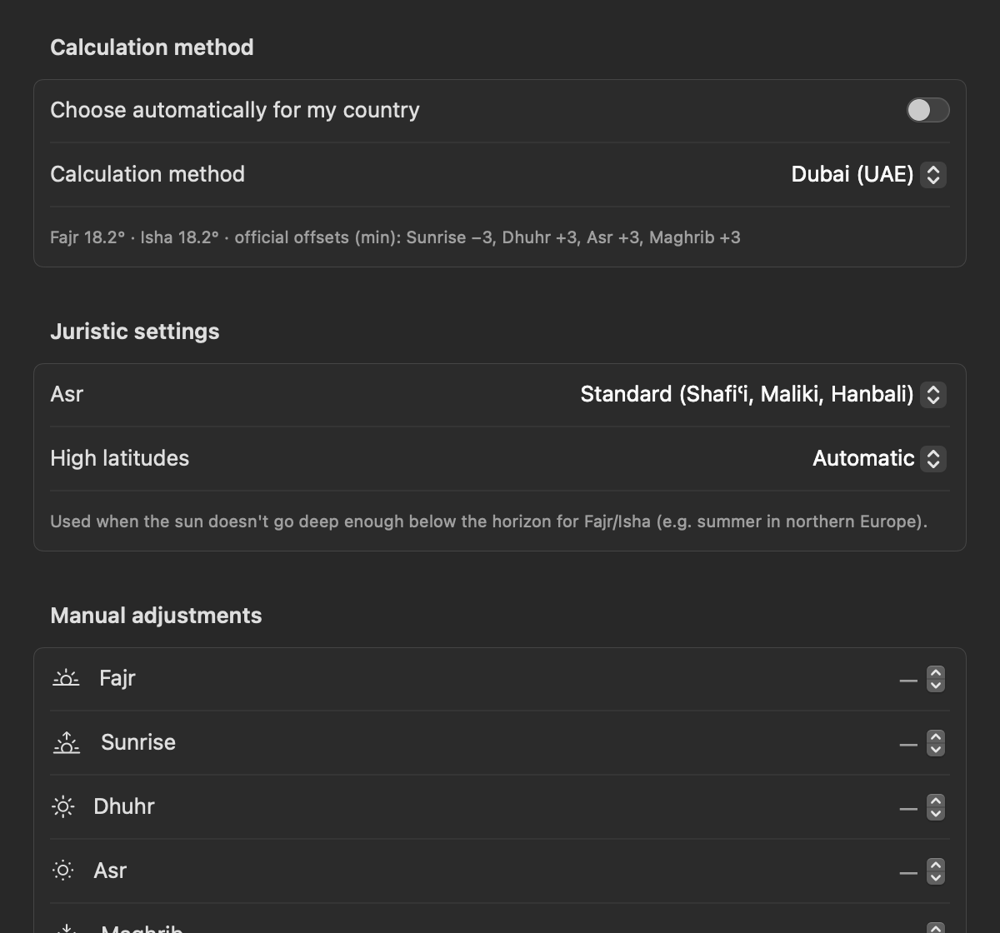 | 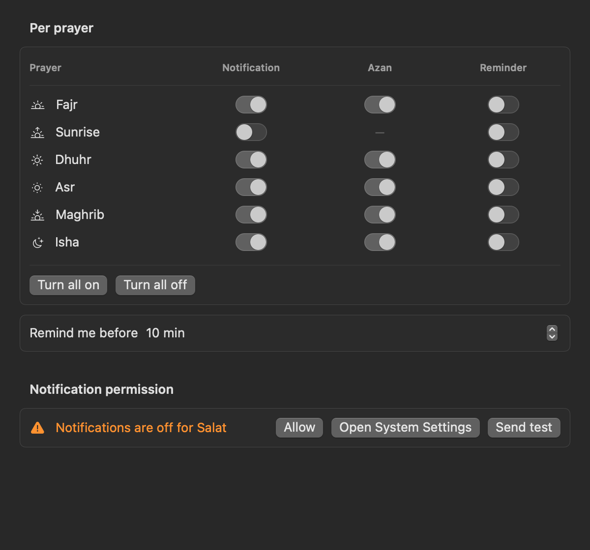 | 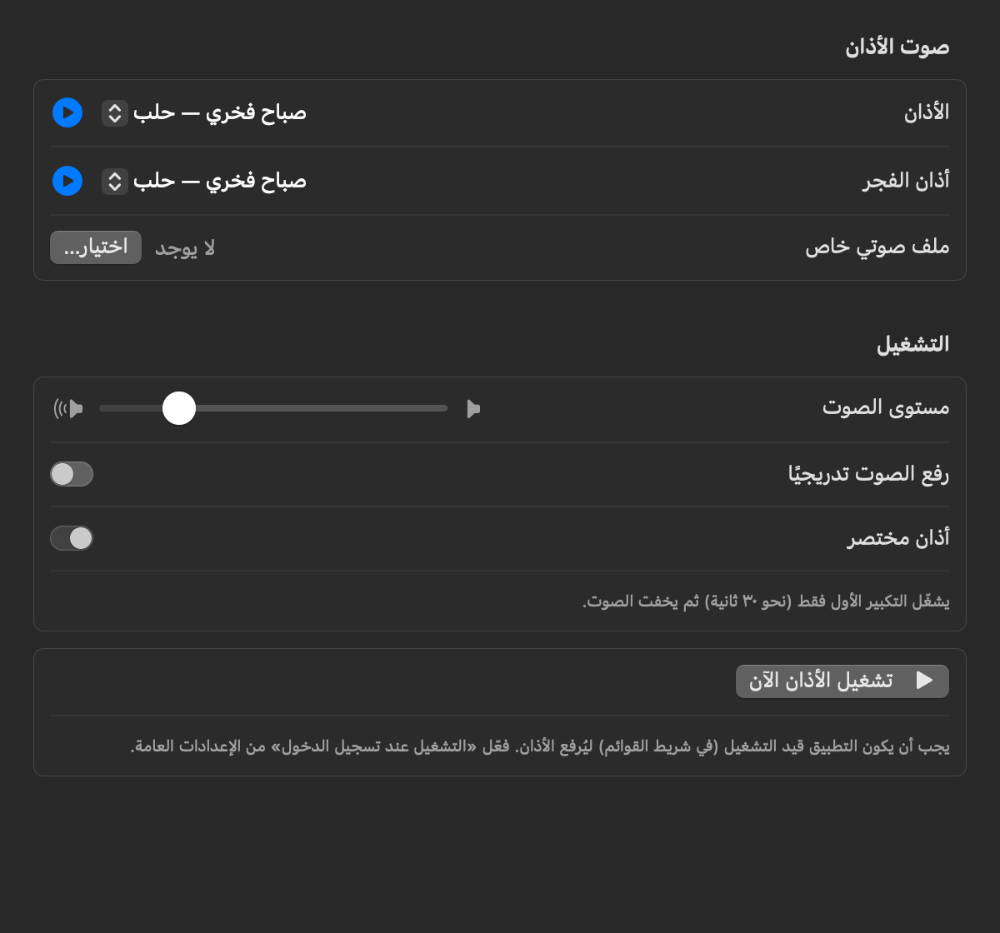 |

| Monthly timetable | First-run setup |
|---|---|
| 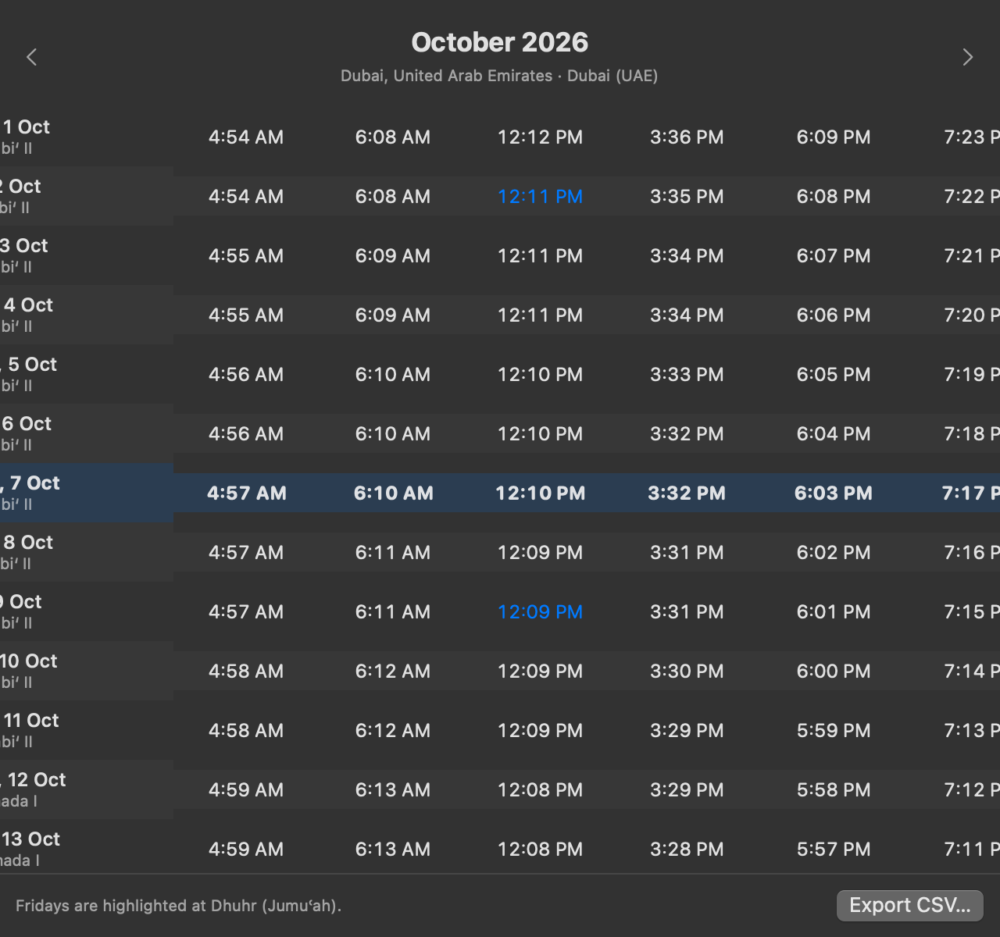 | 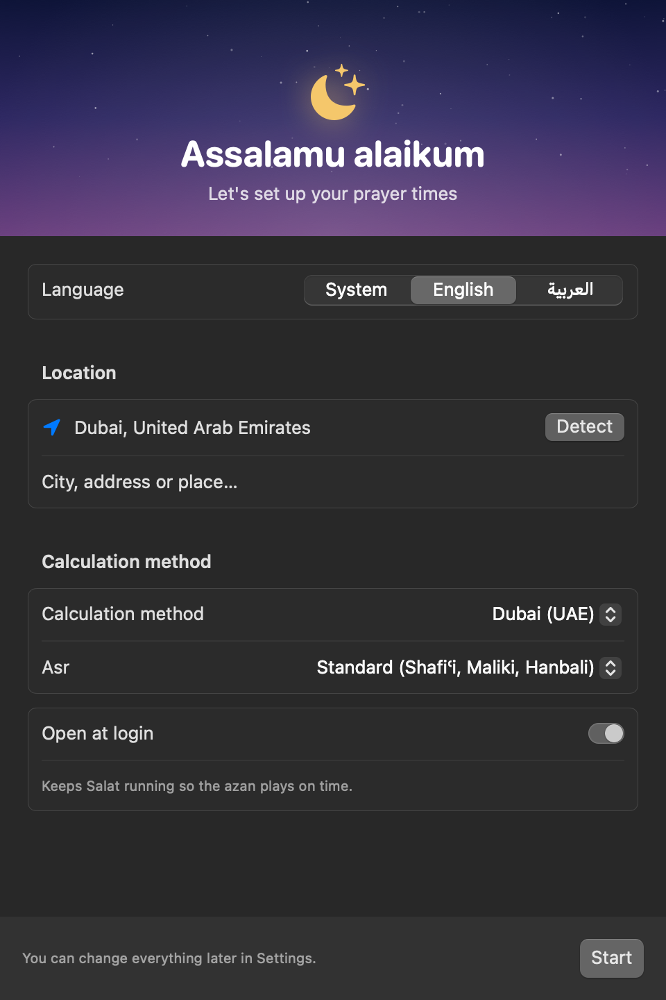 |

## Install

1. Download `Salat-x.y.z.dmg` from [Releases](https://github.com/mpcabd/salat-widget/releases/latest), open it, and drag **Salat** to **Applications**.
2. The app is ad-hoc signed but not notarized by Apple, so macOS will block it the first time. To allow it, either:
   - open **System Settings → Privacy & Security** and click **Open Anyway**, or
   - run `xattr -dr com.apple.quarantine /Applications/Salat.app`
3. Launch it, pick your location and method, and keep **Open at login** on so the Azan always plays on time.

Requires macOS 14 Sonoma or later. Runs natively on Apple silicon and Intel.

## Build from source

You only need the Command Line Tools (Xcode is not required):

```sh
scripts/build-app.sh            # -> build/Salat.app (universal, ad-hoc signed)
scripts/build-app.sh --install  # also copies to /Applications and launches it
scripts/make-dmg.sh 1.0.0       # -> build/Salat-1.0.0.dmg
```

### Project layout

```
Sources/PrayerKit/     Pure-Swift astronomical engine (methods, high-latitude rules, Qibla)
Sources/Salat/         SwiftUI app: model, services (Azan, notifications, location, widget), views
Tests/PrayerKitCheck/  CLI that prints times for a place/method, for diffing against reference tables
scripts/               App bundling, DMG, icon and screenshot compositing
Resources/             Azan audio and app icon
```

### Accuracy

Check the engine against any reference timetable:

```sh
swift run prayerkit-check 21.4225 39.8262 Asia/Riyadh ummAlQura 2026-10-06
```

Results were compared with the [AlAdhan API](https://aladhan.com/prayer-times-api) for Makkah, New York, Cairo, London, Karachi, Istanbul, Tehran, Dubai, Casablanca and Singapore. Fajr, Sunrise, Dhuhr, Maghrib and Isha match to the minute; Asr can differ by one minute because of rounding. The few larger differences are deliberate: Salat applies the official offsets published by Diyanet, Dubai, Morocco and the Moonsighting Committee. **Always defer to your local mosque.** Manual adjustments are one click away.

### Screenshots without clicking

The app has a developer mode that renders every screen to PNG and leaves your settings untouched:

```sh
export SDKROOT=/Library/Developer/CommandLineTools/SDKs/MacOSX26.5.sdk  # CLT only: the macOS 27 SDK's SwiftUI macros need Xcode
swift build --product Salat && .build/debug/Salat --snapshot /tmp/salat-shots --lang ar --time 18:00
```

## Credits

- **Azan recordings** from Wikimedia Commons:
  - [Sabah Fakhri](https://commons.wikimedia.org/wiki/File:Call_to_prayer_by_Sabah_Fakhry.mp3) (public domain)
  - [Aaqib Azeez / Atcovi](https://commons.wikimedia.org/wiki/File:The_Adhan_-_Muslim_Call_to_Prayer_-_Aaqib_Azeez.mp3) (CC BY-SA 4.0)
  - [Adam-synagda](https://commons.wikimedia.org/wiki/File:Beautiful_adhan.ogg) (CC0)
  - [Andrewler](https://commons.wikimedia.org/wiki/File:Azan.ogg) (CC BY-SA 4.0)
  - [Fraguando, Hassan II Mosque](https://commons.wikimedia.org/wiki/File:Llamada_a_oraci%C3%B3n_Mezquita_Hassan_II.wav) (CC BY-SA 4.0)
- **Astronomy**: the solar-position formulas follow [PrayTimes.org](http://praytimes.org). The method offsets and the Moonsighting Committee seasonal model follow the [Adhan](https://github.com/batoulapps/adhan-swift) library.
- **Made by** [Claude](https://claude.com/claude-code), for and published by [@mpcabd](https://github.com/mpcabd).
